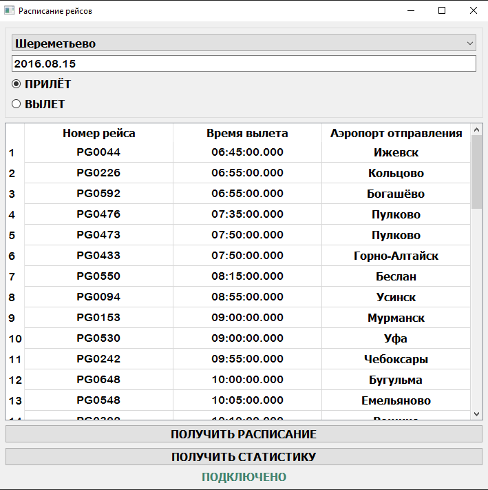
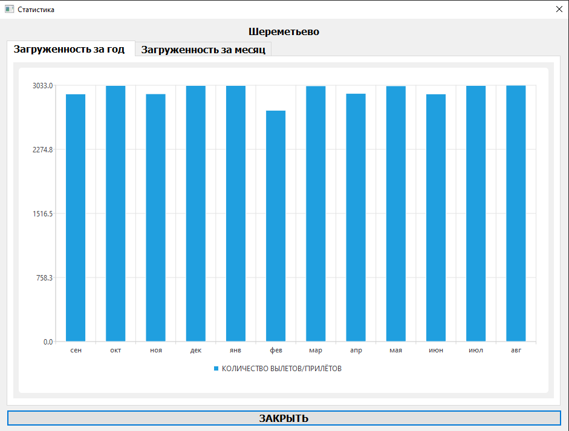
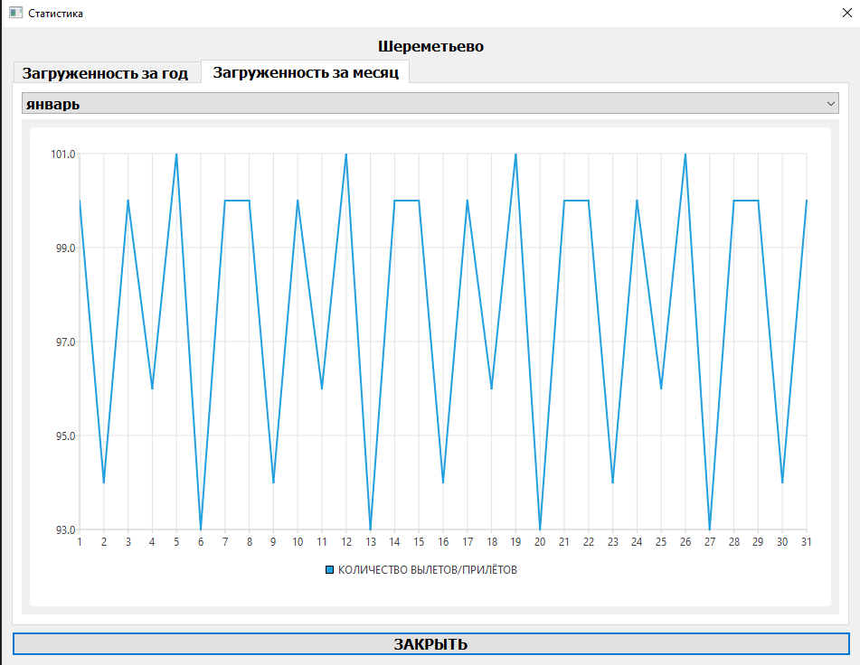
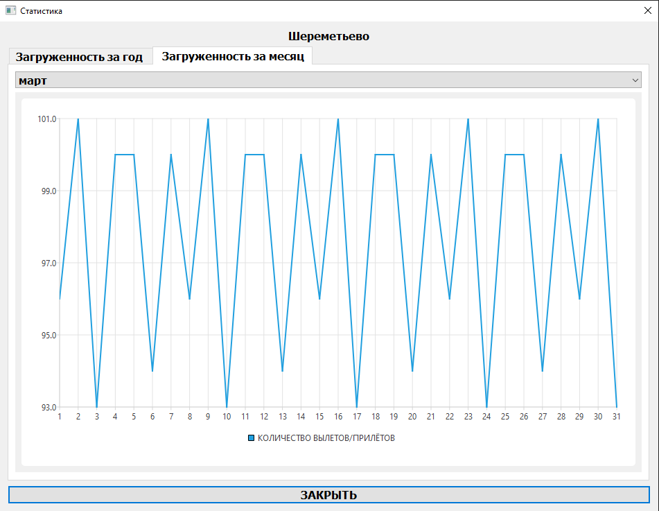
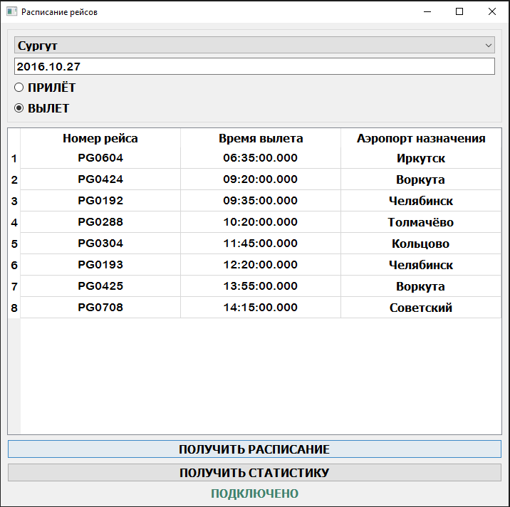

# Airport Inspector

## 🚀 Features

The Airport Inspector application is designed for a wide audience and allows people to view flight schedules and assess airport congestion without going to airport websites. 
Thus, this application helps to reduce the time people spend on flight planning.
The main functionality of the Airport Inspector application is to obtain information from the database provided by Rosaviatsia on flights for the main and regional airports of the country. A list of airports is available to users and by entering a certain date the user can view the schedule of arrivals or departures from the airport of interest. 
To demonstrate the capabilities of the application, Rosaviatsia has provided a database of all flights made for the period 2016-08-15 02:45:00:00.000 +0300 to 2017-09-14 20:55:00:00.000 +0300
An additional functionality of the application is the ability to view the congestion schedules of the selected airport. 
The user's workload is provided for the year in the form of a chart that shows the total number of accepted and released flights for the year, as well as the arrival/departure schedule for the selected month.

## 📥 Download latest release 

[](https://github.com/1123581321345589144233377610/Airport-Inspector/releases)

## 📦 Installation from source

```bash
git clone https://github.com/1123581321345589144233377610/Airport-Inspector.git
cd Airport-Inspector
```

## 🎥 Demo











## 👤 Author

**Dima M. Shirokov**
- [GitHub](https://github.com/1123581321345589144233377610)